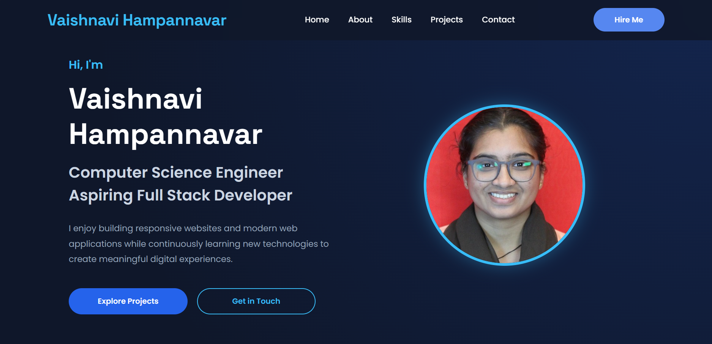

# Personal Portfolio Website

## Project Overview
This is a responsive personal portfolio website developed using HTML5, CSS3, and JavaScript. It showcases my profile, skills, projects, and contact information.

## Features
- Responsive layout
- Hero section
- About section
- Skills section
- Projects section
- Contact section
- Smooth scrolling navigation

## Technologies Used
- HTML5
- CSS3
- JavaScript

## Folder Structure
- index.html
- styles.css
- script.js
- Images

## Output

