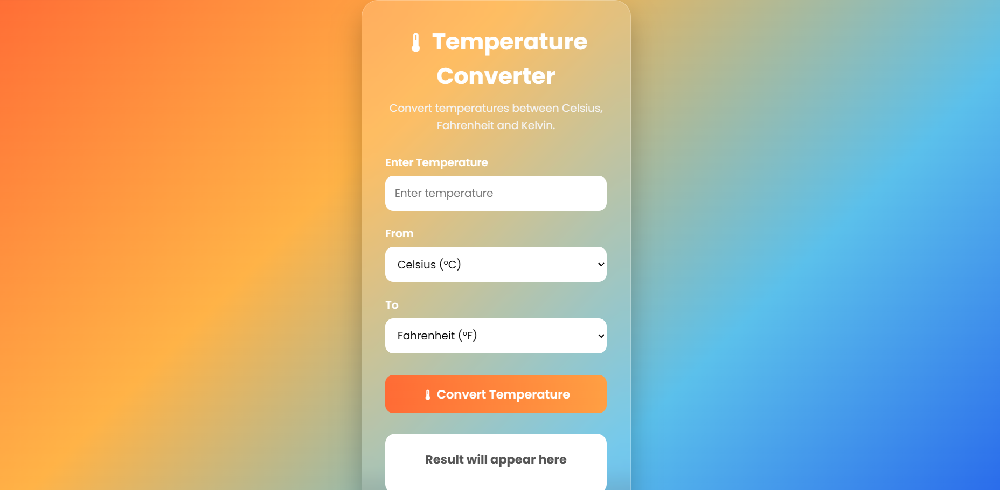
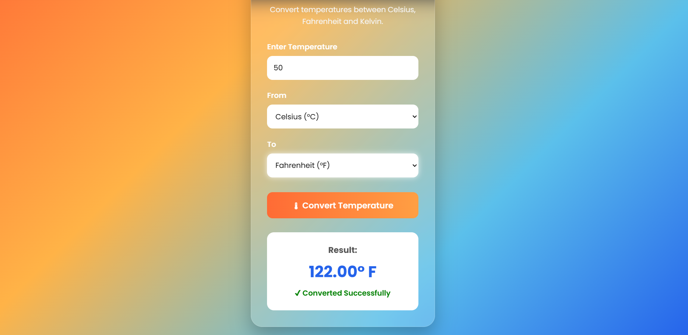

# Temperature Converter

## Project Overview
Temperature Converter is a web application that converts temperature values between Celsius, Fahrenheit, and Kelvin with real-time validation.

## Features
- Celsius, Fahrenheit, and Kelvin conversion
- Input validation
- Absolute zero validation
- Responsive design
- User-friendly interface

## Technologies Used
- HTML5
- CSS3
- JavaScript

## Folder Structure
- index.html
- styles.css
- script.js

## Output

###Home Page

###Menu Page

